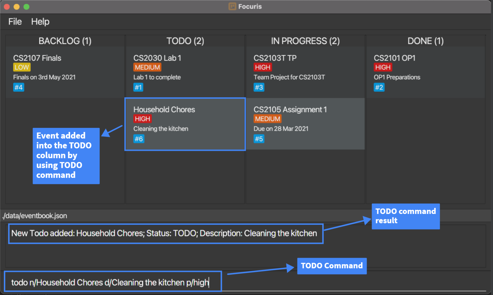
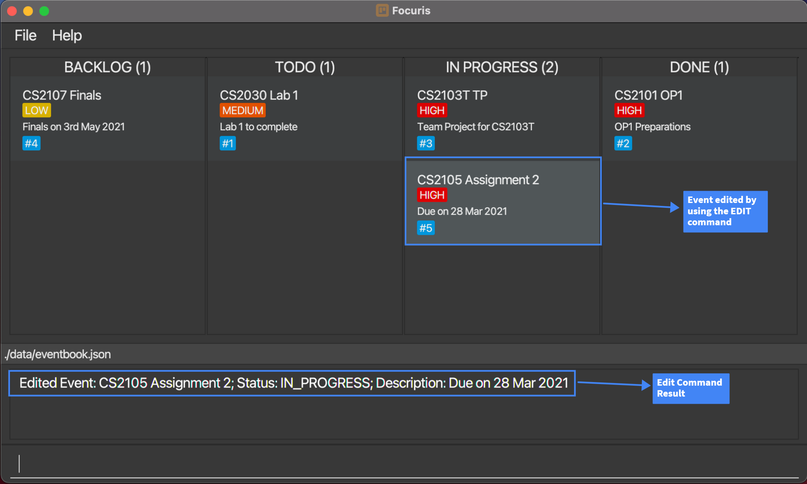
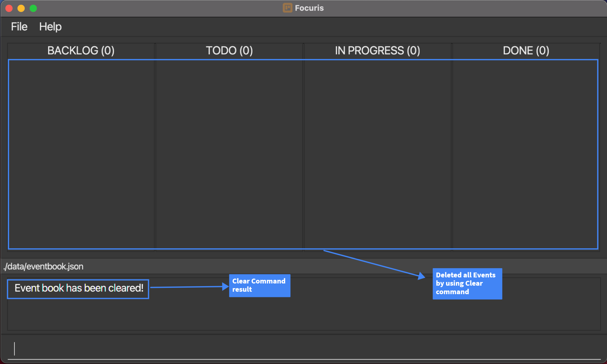

# Welcome to Focuris User Guide!

Focuris is a **desktop application** for **managing events** with a KanBan board, which is a board where your **events displayed according to the level of completion** of each event, which consists of Backlog, Todo, In-Progress and Done.

## Here's why you should use Focuris:

- Focuris is made specially for **university students** like you to keep track of your tasks to complete.
- Use of a Command Line Interface (CLI) allows fast typists to manage your event boards faster than applications with a Graphical User Interface (GUI).
- Gain ability to prioritize your tasks by looking at their priority level, from **Low** to **High**.
- Get instant overview on the level of completion of each of your tasks.

---

# Table Of Contents

<!-- prettier-ignore-start -->
<!-- AUTO-GENERATED TOC - START -->

* Table of Contents
{:toc}

<!-- AUTO-GENERATED TOC - END -->
<!-- prettier-ignore-end -->

---

# 1. Quick start

1. Ensure you have Java `11` or above installed on your Computer.

1. Download the latest `focuris.jar` from [here](https://github.com/AY2021S2-CS2103T-W15-4/tp/releases/tag/v1.3.trial).

1. Copy the `focuris.jar` file to the folder you want to use as the _home folder_ for your Focuris.

1. Double-click the `focuris.jar` file to start the application. The GUI similar to the below should appear in a few seconds. Note how the app contains some sample data.<br>

   

1. Type the command in the command box and press Enter to execute it. e.g. typing **`help`** and pressing Enter will open the help window.<br>
   Some example commands you can try:

   - **`todo`**`n/CS2030 Lab 1 d/Lab 1 to complete` : Adds an event named `CS2030 Lab 1` to the application with status `TODO`.

   - **`log`**`n/CS2107 Finals d/Finals on 3rd May 2021` : Adds an event named `CS2107 Finals` to the application with status `BACKLOG`.

   - **`prog`**`n/CS2100 d/Lab` : Adds an event named `CS2100` to the application with status `IN PROGRESS`.

   - **`delete`**`3` : Deletes the event with the identifier of 3 shown on the KanBan board.

   - **`exit`** : Exits the application.

1. Refer to the [Features](#features) below for details of each command.

[Return to Table of Contents](#table-of-contents)

# 2. Features

<div markdown="block" class="alert alert-info">

**:information_source: Notes about the command format:**<br>

- Words in `UPPER_CASE` are the [parameters](#parameters) to be supplied by the user.<br>
  e.g. in `todo n/NAME d/DESCRIPTION`, `NAME` is a [parameter](#parameters) which can be used as `todo n/CS2030`.

- Items in square brackets are optional.<br>
  e.g `n/NAME d/DESCRIPTION [p/PRIORITY]` can be used as `n/CS2030 d/Assignement p/HIGH` or as `n/CS2030 d/Assignment`.

- [Parameters](#parameters) can be in any order.<br>
  e.g. if the command specifies `n/NAME d/DESCRIPTION`, `d/DESCRIPTION n/NAME` is also acceptable.

- If a [parameter](#parameters) is expected only once in the command but you specified it multiple times, only the last occurrence of the [parameter](#parameters) will be taken.<br>
  e.g. if you specify `d/walk d/run`, only `d/run` will be taken.

- Extraneous [parameters](#parameters) for commands that do not take in [parameters](#parameters) (such as `help` and `exit`) will be ignored.<br>
  e.g. if the command specifies `help 123`, it will be interpreted as `help`.

</div>

[Return to Table of Contents](#table-of-contents)

## 2.1 Summary

### 2.1.1 Command Summary

| Command                           | Description                                     | Format, Examples                                                                                           |
| --------------------------------- | ----------------------------------------------- | ---------------------------------------------------------------------------------------------------------- |
| [**Todo**](#231-todo-command)     | Creates a new event with status **Todo**        | `todo n/NAME d/DESCRIPTION [p/PRIORITY]` <br> e.g., `todo n/CS2040 d/Assignment`                           |
| [**Log**](#232-log-command)       | Creates a new event with status **Backlog**     | `log n/NAME d/DESCRIPTION [p/PRIORITY]` <br> e.g., `log n/CS2030 d/Lab`                                    |
| [**Prog**](#233-prog-command)     | Creates a new event with status **In-Progress** | `prog n/NAME d/DESCRIPTION [p/PRIORITY]` <br> e.g., `prog n/CS2100 d/Tutorial`                             |
| [**Delete**](#237-delete-command) | **Deletes** an existing event                   | `delete IDENTIFIER`<br> e.g., `delete 3`                                                                   |
| [**Edit**](#234-edit-command)     | **Edits** an existing event's attributes        | `edit IDENTIFIER [n/NAME] [s/STATUS] [d/DESCRIPTION] [p/PRIORITY]`<br> e.g.,`edit 2 n/CS2030 d/Assignment` |
| [**Help**](#221-help-command)     | Displays **help menu** pop-up                   | `help`                                                                                                     |
| [**Exit**](#222-exit-command)     | **Exits** the application                       | `exit`                                                                                                     |

[Return to Table of Contents](#table-of-contents)

### 2.1.2 Attribute Summary

| [Attribute](#attributes) | Prefix    | Description                              | Constraints                                                                                                                                             |
| ------------------------ | --------- | ---------------------------------------- | ------------------------------------------------------------------------------------------------------------------------------------------------------- |
| NAME                     | `n/`      | Name of your Event                       | Event names should not contain any [special characters](#special-characters) or be blank                                                                |
| DESCRIPTION              | `d/`      | Description of your Event                | Event descriptions should not contain any [special characters](#special-characters) or be blank                                                         |
| PRIORITY                 | `p/`      | Priority of your Event                   | Event priorities should be either `high`, `medium` or `low`. Priorities are case insensitive, meaning `high` or `HiGH` would be understood the same way |
| IDENTIFIER               | No Prefix | Identifier of your Event in Focuris      | Event identifier should exist in the KanBan board.                                                                                                      |
| KEYWORD                  | No Prefix | Keywords for searching Events in Focuris | No Constraints                                                                                                                                          |

[Return to Table of Contents](#table-of-contents)

## 2.2 General

For ease of reference:


### 2.2.1 `help` Command

Shows a pop-up with a link to the Focuris user guide.

#### Format

```bash
help
```

#### Expected Outcome

- Pop-up displays link to the user guide.


[Return to Table of Contents](#table-of-contents)

### 2.2.2 `exit` Command

Exits out of Focuris.

#### Format

```
exit
```

#### Expected Outcome

- Your Focuris application window closes.

[Return to Table of Contents](#table-of-contents)

### 2.2.3 Saving of your data

Event data in Focuris is saved **automatically** whenever you execute any command that makes changes to events. As such, there is no need for you to trigger manually saving of data.

[Return to Table of Contents](#table-of-contents)

### 2.2.4 Editing your data file

Focuris' data is saved as a JSON file `[JAR_FILE_LOCATION]/data/eventbook.json`.

<div markdown="block" class="alert alert-info">
:information_source: **Advanced Users:**
If you are an advanced user, you are welcome to update the data file by editing the data file directly.
</div>

<div markdown="span" class="alert alert-warning">:exclamation: **Caution:**
If your changes to the data file makes its format invalid, Focuris will discard all your existing data and start with an empty data file on the next run.
</div>

[Return to Table of Contents](#table-of-contents)

## 2.3 Event Commands

### 2.3.1 `todo` Command

Adds an event with status `TODO` to Focuris.

#### Format

```
todo n/NAME d/DESCRIPTION [p/PRIORITY]
```

#### Examples



**Figure 1. Shows the result after execution of Example Command 1 in the table below.**

| No  | Example Command                                                               | Expected Command Result                                                                                        |
| --- | ----------------------------------------------------------------------------- | -------------------------------------------------------------------------------------------------------------- |
| 1   | `todo n/Household Chores d/Cleaning the kitchen p/high`                       | New Todo added: Household Chores; Status: TODO; Description: Cleaning the kitchen                              |
| 2   | `todo n/CS2030 Assignment 1 d/Due on 23 Mar 2021 p/high`                      | New Todo added: CS2030 Assignment 1; Status: TODO; Description: Due on 23 Mar 2021                             |
| 3   | `todo n/Lunch with John d/At VivoCity on Friday p/medium`                     | New Todo added: Lunch with John; Status: TODO; Description: At VivoCity on Friday                              |
| 4   | `todo n/Complete Homework d/Complete weekly quiz and group tasks for CS2103T` | New Todo added: Complete Homework; Status: TODO; Description: Complete weekly quiz and group tasks for CS2103T |

[Return to Table of Contents](#table-of-contents)

### 2.3.2 `log` Command

Adds an event with status `BACKLOG` to Focuris.

#### Format

```
log n/NAME d/DESCRIPTION [p/PRIORITY]
```

#### Examples


**Figure 2. Shows the result after execution of Example Command 1 in the table below.**

| No  | Example Command                                                              | Expected Command Result                                                                                              |
| --- | ---------------------------------------------------------------------------- | -------------------------------------------------------------------------------------------------------------------- |
| 1   | `log n/Complete Homework d/Complete weekly quiz and group tasks for CS2103T` | New BackLog added: Complete Homework; Status: BACKLOG; Description: Complete weekly quiz and group tasks for CS2103T |
| 2   | `log n/Household Chores d/Cleaning the kitchen p/high`                       | New BackLog added: Household Chores; Status: BACKLOG; Description: Cleaning the kitchen                              |
| 3   | `log n/CS2030 Assignment 1 d/Due on 23 Mar 2021 p/high`                      | New BackLog added: CS2030 Assignment 1; Status: BACKLOG; Description: Due on 23 Mar 2021                             |
| 4   | `log n/Lunch with John d/At VivoCity on Friday p/medium`                     | New BackLog added: Lunch with John; Status: BACKLOG; Description: At VivoCity on Friday                              |

[Return to Table of Contents](#table-of-contents)

### 2.3.3 `prog` Command

Adds an event with status `IN PROGRESS` to Focuris.

#### Format

```
prog n/NAME d/DESCRIPTION [p/PRIORITY]
```

#### Examples


**Figure 3. Shows the result after execution of Example Command 1 below.**

| No  | Example Command                                                               | Expected Command Result                                                                                                      |
| --- | ----------------------------------------------------------------------------- | ---------------------------------------------------------------------------------------------------------------------------- |
| 1   | `prog n/CS2030 Assignment d/Due on 23 May 2021 p/medium`                      | New In-Progress added: CS2030 Assignment 1; Status: IN_PROGRESS; Description: Due on 23 Mar 2021                             |
| 2   | `prog n/Complete Homework d/Complete weekly quiz and group tasks for CS2103T` | New In-Progress added: Complete Homework; Status: IN_PROGRESS; Description: Complete weekly quiz and group tasks for CS2103T |
| 3   | `prog n/Household Chores d/Cleaning the kitchen p/high`                       | New In-Progress added: Household Chores; Status: IN_PROGRESS; Description: Cleaning the kitchen                              |
| 4   | `prog n/Lunch with John d/At VivoCity on Friday p/medium`                     | New In-Progress added: Lunch with John; Status: IN_PROGRESS; Description: At VivoCity on Friday                              |

[Return to Table of Contents](#table-of-contents)

### 2.3.4 `edit` Command

Edits an existing event in Focuris.

#### Format

```
edit IDENTIFIER [n/NAME] [d/DESCRIPTION] [s/STATUS] [p/PRIORITY]
```

- Edits the event at the specified `IDENTIFIER`.
- The identifier refers to the index number shown in the respective displayed event list.
- The identifier **must be a positive integer** 1, 2, 3, …​
- At least one of the optional fields must be provided.

<div markdown="block" class="alert alert-info">
:exclamation: **Caution**

Existing event will have its data overwritten by the new values taken in by the `edit` command

</div>

#### Examples

- `edit 1 n/CS2030 d/Assignment` Edits the event name and event description of the event with identifier `#1` to be `CS2030` and `Assignment` respectively.
- `edit 2 s/backlog` Edits the status of the event with identifier `#2` to be `BACKLOG`
- `edit 3 n/CS1101S d/Streams assignment s/in_progress p/high` Edits event the event name, description, status and priority of the event with identifier `#3` to be `CS1101S`, `Streams assignment`, `IN_PROGRESS`, `HIGH` respectively.


**Figure 4. Shows Focuris before execution of the edit command in the command box.**



**Figure 5. Shows Focuris after execution of the edit command in the command box.**

[Return to Table of Contents](#table-of-contents)

### 2.3.5 `delete` Command

Deletes the specified event from Focuris.

#### Format

```
delete IDENTIFIER
```

- Deletes the event at the specified `IDENTIFIER`
- The identifier refers to the number beside the hex symbol, e.g. `#10` has an identifier of 10.
- The identifier **must be a positive integer** 1, 2, 3, …​

#### Examples


**Figure 6. Shows Focuris _before_ the execution of the delete command in the command box.**


**Figure 7. Shows Focuris _after_ the execution of the delete command in the command box.**

| No  | Example Command | Expected Command Result                                                                  |
| --- | --------------- | ---------------------------------------------------------------------------------------- |
| 1   | `delete 1`      | Deleted Event: CS2030 Lab 1; Status: TODO; Description: Lab 1 to complete;               |
| 2   | `delete 5`      | Deleted Event: CS2105 Assignment 2; Status: IN_PROGRESS; Description: Due on 28 Mar 2021 |

<div markdown="block" class="alert alert-info">

**:information_source: Note** <br>
The commands in the table above make reference to the events in Focuris as seen in Figure 7.

</div>

### 2.3.6 `clear` Command

Clears all events in Focuris.

#### Format

```
clear
```

<div markdown="span" class="alert alert-warning">

:exclamation: **Caution:**
All events will be cleared from Focuris and this is **irreversible**. Please use this command with care.

</div>

#### Expected Outcome

- All events are cleared from Focuris.



**Figure 8. Shows Focuris after a clear command has been executed.**

[Return to Table of Contents](#table-of-contents)

## 3. FAQ

**Q**: How do I transfer my data to another Computer?<br>
**A**: Install the app in the other computer and overwrite the empty data file it creates with the file that contains the data of your previous Focuris home folder.

[Return to Table of Contents](#table-of-contents)

## 4. Glossary

<a name="special-characters"><bold>Special Characters</bold>: Characters that are neither alphabets, from A to Z, nor digits, from 0 to 9.</a>

<a name="attributes"><bold>Attributes</bold>: Attributes are names of different inputs that a command takes in.</a>

<a name="parameters"><bold>Parameters</bold>: Parameters are the input given to commands behind prefixes such as `n/`.</a>

[Return to Table of Contents](#table-of-contents)
