# Welcome to Focuris User Guide!

Thank you for downloading **Focuris**! As a busy University student, Focuris helps you manage and keep track of all your
work, deadlines, and projects. We hope this **User Guide** helps you get started with Focuris so you can start making
your student life a little easier! <br/>

Focuris is a **desktop application** for **managing events** with a KanBan board. The KanBan board is a board which
**displays events according to the level of completion**: Backlog, Todo, In-Progress and Done. <br/>

Focuris aims to help **university students** like you to keep track of your tasks or events in order to help improve time management
and organisation.

Get started quickly on your journey with Focuris [here](#1-quick-start)!

## Here's why you should use Focuris:

As a student, have you ever been overwhelmed by work in the middle of the semester? Or have you ever struggled to
keep track of all your deadlines and projects? Or perhaps have you ever wondered what work to prioritise when things
get hectic? Well, Focuris is here to help! Focuris can:

- Help with task management and scheduling through a simple and easy to navigate interface.
- Use a Command Line Interface (CLI) which allows fast typists to manage your event boards faster than applications with a Graphical User Interface (GUI).
- Prioritise your tasks by looking at their priority level, from **Low** to **High**.
- Get instant overview on the level of completion of each of your tasks.

## How to use our User Guide:

- To get started quickly, head to [1. Quick Start](#1-quick-start)!
- To learn about conventions in this User Guide, head to [2. Features](#2-features)!
- To get an overview of all our Commands, head to [2.1.1 Command Summary](#211-command-summary)!
- To learn about the parameters for our Commands, head to [2.1.2 Parameters](#212-parameter-summary)!
- To get answers to some FAQs, head to [3. FAQ](#3-faq)!
- To learn more about some keywords we use, head to [4. Glossary](#4-glossary)!

Feel free to read on or check out our [Table of Contents](#table-of-contents), to learn more about our features
and customise your experience with Focuris!

---

<div class="page-break-before"></div>

# Table Of Contents

<!-- prettier-ignore-start -->
<!-- AUTO-GENERATED TOC - START -->

* Table of Contents
{:toc}

<!-- AUTO-GENERATED TOC - END -->
<!-- prettier-ignore-end -->
i
---

<div class="page-break-before"></div>

# 1. Quick start

This section will explain how you can get Focuris up and running in the shortest way possible.

Start improving your productivity by following these simple steps:

1. Ensure you have Java `11` or above installed on your Computer.

1. You can download the latest `focuris.jar` from [here](https://github.com/AY2021S2-CS2103T-W15-4/tp/releases/tag/v1.3).

1. Copy the `focuris.jar` file to the folder you want to use as the _home folder_ for your installation of Focuris.

1. Double-click the `focuris.jar` file to start Focuris.
   You should be able to see the graphical user interface within a few seconds. Note that the application contains some sample data since you are new to the application. <br/>
   The image below is the interface you will see when you first start up Focuris.
   <br> 
   Check out [2.2 General](#22-general) for more information about the User Interface!

1. Type the command in the command box and press Enter to execute it. e.g. typing **`help`** and pressing Enter will open the help window.<br>
   Here are some commands you can get started with:

   - **`todo`**`n/CS2030 Lab 2 d/Lab 2 to complete` : Adds an event named `CS2030 Lab 2` to the application with status `TODO`.

   - **`log`**`n/CS2107 Mid Terms d/Mid terms on 2nd Mar 2021` : Adds an event named `CS2107 Mid Terms` to the application with status `BACKLOG`.

   - **`prog`**`n/CS2100 Lab 3 d/Lab homework` : Adds an event named `CS2100 Lab 3` to the application with status `IN PROGRESS`.

   - **`delete`**`3` : Deletes the event with the identifier of 3 shown on the KanBan board.

   - **`exit`** : Exits the application.

1. Refer to the [Features](#2-features) below for how you can utilise each command.

<a class="md-btn md-btn-outline" href="#table-of-contents">Return to Table of Contents</a>

<div class="page-break-before"></div>

# 2. Features

You will find out more about the various commands we have in Focuris after reading this chapter.

Continue reading for more ways to improve your productivity with Focuris!

<div markdown="block" class="alert alert-info">

**:information_source: Please take note about the following when you enter commands into Focuris**<br>

- Words in `UPPER_CASE` are the [parameters](#parameters) you can provide to Focuris.<br>
  e.g. in `todo n/NAME d/DESCRIPTION`, `NAME` is a [parameter](#parameters) which can be used as `todo n/CS2030`.

- Items in square brackets are optional.<br>
  e.g `n/NAME d/DESCRIPTION [p/PRIORITY]` can be used as `n/CS2030 d/Assignement p/HIGH` or as `n/CS2030 d/Assignment`.

- You can type in the [parameters](#parameters) in any order.<br>
  e.g. if the command specifies `n/NAME d/DESCRIPTION`, you can type it as `d/DESCRIPTION n/NAME` as well.

- If a [parameter](#parameters) is expected only once in the command but you specified it multiple times, only the last occurrence of the [parameter](#parameters) will be taken.<br>
  e.g. if you specify `d/walk d/run`, only `d/run` will be taken.

- Extraneous [parameters](#parameters) for commands that do not take in [parameters](#parameters) (such as `help` and `exit`) will be result in an error message.<br>
  e.g. if you type `help 123`, Focuris will show an error that says `Please remove extra irrelevant arguments!`.
</div>

<a class="md-btn md-btn-outline" href="#table-of-contents">Return to Table of Contents</a>

<div class="page-break-before"></div>

## 2.1 Summary

The summary chapter gives you an overview of what the available commands are and what the parameters you should type into the Command Box of Focuris are.

<a class="md-btn md-btn-outline" href="#table-of-contents">Return to Table of Contents</a>

<div class="page-break-before"></div>

### 2.1.1 Command Summary

If you are an experienced user who has used Focuris before, here is a summary of the commands you can navigate between easily!

For our new users, don't be too intimidated! You can use this summary to better familiarize yourself with
the different commands available. We will delve deeper into the specifics at chapters [2.2](#22-general)
and [2.3](#23-event-commands).

| Command                            | Description                                                          | Format, Examples                                                                                           |
| ---------------------------------- | -------------------------------------------------------------------- | ---------------------------------------------------------------------------------------------------------- |
| [**Clear**](#236-clear-command)    | **Clears** all of your events in Focuris                             | `clear`                                                                                                    |
| [**Delete**](#235-delete-command)  | **Deletes** an existing event in Focuris                             | `delete IDENTIFIER`<br> e.g., `delete 2`                                                                   |
| [**Done**](#239-done-command)      | Marks an existing event in Focuris as **`DONE`**                     | `done IDENTIFIER`<br> e.g., `done 3`                                                                       |
| [**Edit**](#234-edit-command)      | **Edits** your existing event's [parameters](#parameters) in Focuris | `edit IDENTIFIER [n/NAME] [s/STATUS] [d/DESCRIPTION] [p/PRIORITY]`<br> e.g.,`edit 2 n/CS2030 d/Assignment` |
| [**Find**](#237-find-command)      | **Finds** your existing event by specific keywords                   | `find KEYWORD [KEYWORD]...`<br> e.g., `find James Jake`                                                    |
| [**Exit**](#222-exit-command)      | **Exits** the application                                            | `exit`                                                                                                     |
| [**Help**](#221-help-command)      | Displays **help menu** pop-up                                        | `help`                                                                                                     |
| [**List**](#238-list-command)      | Clears your previous filters and **lists** all events                | `list`                                                                                                     |
| [**Log**](#232-log-command)        | Creates your new event with status **Backlog**                       | `log n/NAME d/DESCRIPTION [p/PRIORITY]` <br> e.g., `log n/CS2030 d/Lab`                                    |
| [**Prog**](#233-prog-command)      | Creates your new event with status **In-Progress**                   | `prog n/NAME d/DESCRIPTION [p/PRIORITY]` <br> e.g., `prog n/CS2100 d/Tutorial`                             |
| [**Switch**](#2310-switch-command) | **Switch** between list and kanban view in Focuris                   | `prog n/NAME d/DESCRIPTION [p/PRIORITY]` <br> e.g., `prog n/CS2100 d/Tutorial`                             |
| [**Todo**](#231-todo-command)      | Creates your new event with status **Todo**                          | `todo n/NAME d/DESCRIPTION [p/PRIORITY]` <br> e.g., `todo n/CS2040 d/Assignment`                           |

<div markdown="block" class="alert alert-info">

**:information_source: Please take note of the following with regards to Events in Focuris:** <br>

- You will not be allowed to add Events with the same name into Focuris, regardless of their description, priority or status.
- Events of the same name are treated as case-insensitive. <br>
  e.g. `CS2030` is the same name as `cs2030`.
- Note that commands are case sensitive, so you must follow the format given closely! <br>
  e.g. `list` will work, but `LIST` or `LiSt` or any other variant will not work. 
- Also note that for the commands where square brackets `[ ]` appear, it indicates that those a optional fields, which means that you do not 
necessarily have to type them in if you do not want to, as shown in the table above under <b>Format, Examples</b>.


</div>

<a class="md-btn md-btn-outline" href="#table-of-contents">Return to Table of Contents</a>

<div class="page-break-before"></div>

### 2.1.2 Parameter Summary

You may encounter several [parameters](#parameters) while typing in commands in Focuris which might be unknown to you. <br/>
The table below gives a detailed summary of the different [parameters](#parameters) you will encounter while using Focuris.

| Parameter   | Prefix    | Description                              | Constraints                                                                                                                                                                                                                                                                                |
| ----------- | --------- | ---------------------------------------- | ------------------------------------------------------------------------------------------------------------------------------------------------------------------------------------------------------------------------------------------------------------------------------------------ |
| NAME        | `n/`      | Name of your Event                       | Your Event names should not contain any [special characters](#special-characters) or be blank                                                                                                                                                                                              |
| DESCRIPTION | `d/`      | Description of your Event                | Your Event descriptions should not contain any [special characters](#special-characters) or be blank                                                                                                                                                                                       |
| PRIORITY    | `p/`      | Priority of your Event                   | Your Event priorities should be either `high`, `medium` or `low`. <br/> Priorities can be shorthanded to be `h` , `m` or `l` respectively. <br/>Priorities are [case insensitive](#case-insensitive), meaning `high` or `HiGH` would be understood the same way.<br/>                      |
| STATUS      | `s/`      | Status of your Event                     | Your Event statuses should be either `backlog`, `todo`, `in_progress` or `done`. <br/> Statuses can be shorthanded to be `bl` , `td`, `ip` or `d` respectively. <br/> Statuses are [case insensitive](#case-insensitive), meaning `backlog` or `BackLog` would be understood the same way. |
| IDENTIFIER  | No Prefix | Identifier of your Event in Focuris      | Your Event identifier should exist in the KanBan board.                                                                                                                                                                                                                                    |
| KEYWORD     | No Prefix | Keywords for searching Events in Focuris | No Constraints                                                                                                                                                                                                                                                                             |

<div markdown="block" class="alert alert-info">
**:information_source: Please take note of the following with regards to parameters in Focuris:** <br/>
- Identifiers are not meant to be a counter of your events. It is meant to be a unique identifier for your Events in Focuris and may not count in order.
- Identifiers are automatically generated for you, you do not need to specify an identifier for your Events.
- Identifiers will be recalculated every time you run Focuris.
- Identifiers do not get reset to 1 after a `clear` command.
- Priority is set to `low` if you do not specify a priority for your event. <br/>
</div>

<a class="md-btn md-btn-outline" href="#table-of-contents">Return to Table of Contents</a>

<div class="page-break-before"></div>

## 2.2 General

As a new user, the image below should give you a better understanding of what each part of our graphical user interface means!

There are two views in Focuris, which can be toggled with the [`switch` command](#2310-switch-command):

1. `KanBan` view <br/>
   

2. `List` view<br/>
   
This is how your events are displayed:
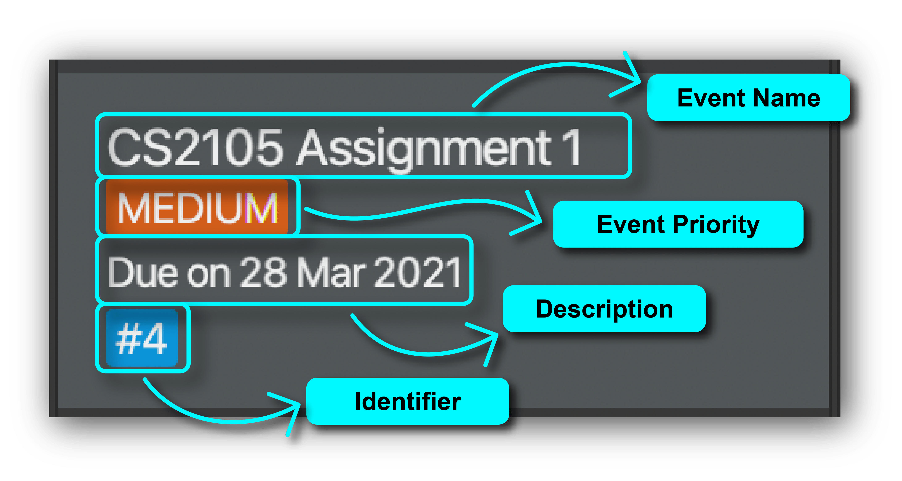

**:information_source: Please take note that Events are not sorted by their Priority in Focuris (Coming soon!)** <br/>

<a class="md-btn md-btn-outline" href="#table-of-contents">Return to Table of Contents</a>

<div class="page-break-before"></div>

### 2.2.1 `help` Command

Shows you a pop-up with a link to the Focuris user guide.

**What you should type into the Command Box:**

```bash
help
```

**What you should expect to happen:**

- Pop-up shows you the link to Focuris' user guide.


<a class="md-btn md-btn-outline" href="#table-of-contents">Return to Table of Contents</a>

<div class="page-break-before"></div>

### 2.2.2 `exit` Command

Exits out of Focuris.

**What you should type into the Command Box:**

```
exit
```

**What you should expect to happen:**

- Your Focuris application window closes.

<a class="md-btn md-btn-outline" href="#table-of-contents">Return to Table of Contents</a>

<div class="page-break-before"></div>

### 2.2.3 Saving of your data

Your Event data in Focuris is saved **automatically** whenever you execute any command that makes changes to events.

You can be assured that **your data is safe** and there is no need for you to save your data manually through executing a command.

<a class="md-btn md-btn-outline" href="#table-of-contents">Return to Table of Contents</a>

### 2.2.4 Editing your data file

Your data in Focuris is saved as a JSON file in this location: `[JAR_FILE_LOCATION]/data/eventbook.json`

- Where `JAR_FILE_LOCATION` refers to the folder in which you store your `focuris.jar` application.

<div markdown="block" class="alert alert-info">
:information_source: **Advanced Users:**
If you are an advanced user, you are welcome to update the data file by editing the data file directly.
</div>

<div markdown="span" class="alert alert-warning">:exclamation: **Caution:**
If your changes to the data file makes its format invalid, Focuris will discard all your existing data and start with an empty data file on the next run.
</div>

<a class="md-btn md-btn-outline" href="#table-of-contents">Return to Table of Contents</a>

<div class="page-break-before"></div>

## 2.3 Event Commands

For the majority of event commands, you can simply execute them via these simple steps:

1. Type the command you desire in the command box with the specified format detailed below.
2. Hit `enter` on your keyboard!
3. The result of your command should be visible on the Result Box, while the outcome of your command should be 
visible on the `KanBan` or `List` view (depending on your view) above the Result Box.

Start discovering and using the Commands now by going to the Command Summary!

<a class="md-btn md-btn-raised" href="#211-command-summary">Bring me to the Command Summary</a>

<a class="md-btn md-btn-outline" href="#table-of-contents">Return to Table of Contents</a>

<div class="page-break-before"></div>

### 2.3.1 `todo` Command

Adds an event with status `TODO` to Focuris.

**What you should type into the Command Box:**

```
todo n/NAME d/DESCRIPTION [p/PRIORITY]
```

**What you should expect to happen:**

- Before executing `todo n/Household Chores d/Cleaning the kitchen p/high`:
  

- After executing `todo n/Household Chores d/Cleaning the kitchen p/high`:
  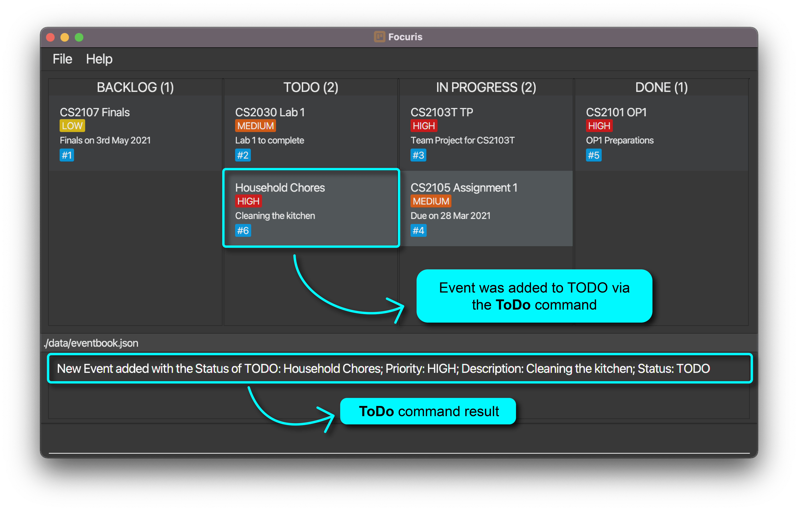

**More Sample Commands:**

| No  | Example Command                                                                        | Expected Command Result                                                                                                          |
| --- | -------------------------------------------------------------------------------------- | -------------------------------------------------------------------------------------------------------------------------------- |
| 1   | `todo n/CS2030 Assignment 1 d/Due on 23 Mar 2021 p/h`                                  | New Todo added: CS2030 Assignment 1; Priority: HIGH; Description: Due on 23 Mar 2021; Status: TODO                               |
| 2   | `todo n/Lunch with John d/At VivoCity on Friday p/m`                                   | New Todo added: Lunch with John; Priority: MEDIUM; Description: At VivoCity on Friday; Status: TODO                              |
| 3   | `todo n/Complete Homework d/Complete weekly quiz and group tasks for CS2103T p/medium` | New Todo added: Complete Homework; Priority: MEDIUM; Description: Complete weekly quiz and group tasks for CS2103T; Status: TODO |
| 4   | `todo n/Run d/Exercise p/h`                                                            | New Todo added: Run; Priority: HIGH; Description: Exercise; Status: TODO                                                         |

<a class="md-btn md-btn-outline" href="#table-of-contents">Return to Table of Contents</a>

<div class="page-break-before"></div>

### 2.3.2 `log` Command

Adds an event with status `BACKLOG` to Focuris.

**What you should type into the Command Box:**

```
log n/NAME d/DESCRIPTION [p/PRIORITY]
```

**What you should expect to happen:**

- Before executing `log n/Complete Homework d/Complete weekly quiz and group tasks for CS2103T`:
  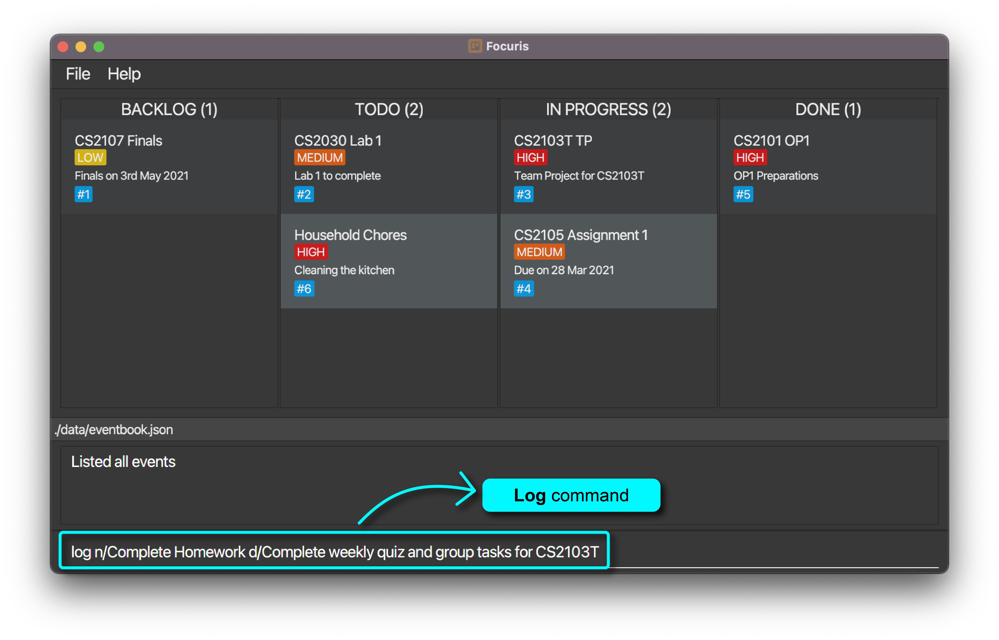
- After executing `log n/Complete Homework d/Complete weekly quiz and group tasks for CS2103T`:
  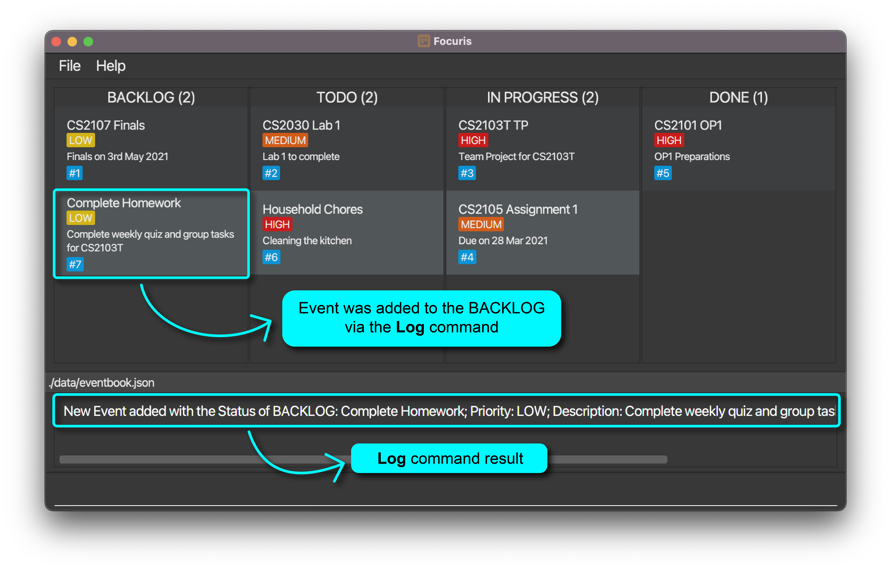

**More Sample Commands:**

| No  | Example Command                                          | Expected Command Result                                                                                    |
| --- | -------------------------------------------------------- | ---------------------------------------------------------------------------------------------------------- |
| 1   | `log n/Household Chores d/Cleaning the kitchen p/h`      | New BackLog added: Household Chores; Priority: HIGH; Description: Cleaning the kitchen; Status: BACKLOG    |
| 2   | `log n/CS2030 Assignment 1 d/Due on 23 Mar 2021 p/m`     | New BackLog added: CS2030 Assignment 1; Priority: MEDIUM; Description: Due on 23 Mar 2021; Status: BACKLOG |
| 3   | `log n/Lunch with John d/At VivoCity on Friday p/medium` | New BackLog added: Lunch with John; Priority: MEDIUM; Description: At VivoCity on Friday; Status: BACKLOG  |
| 4   | `log n/Run d/Exercise p/high`                            | New BackLog added: Run; Priority: HIGH; Description: Exercise; Status: BACKLOG                             |

<a class="md-btn md-btn-outline" href="#table-of-contents">Return to Table of Contents</a>

<div class="page-break-before"></div>

### 2.3.3 `prog` Command

Adds an event with status `IN PROGRESS` to Focuris.

**What you should type into the Command Box:**

```
prog n/NAME d/DESCRIPTION [p/PRIORITY]
```

**What you should expect to happen:**

- Before executing `prog n/CS2030 Assignment d/Due on 23 May 2021 p/medium`:
  
- After executing `prog n/CS2030 Assignment d/Due on 23 May 2021 p/medium`:
  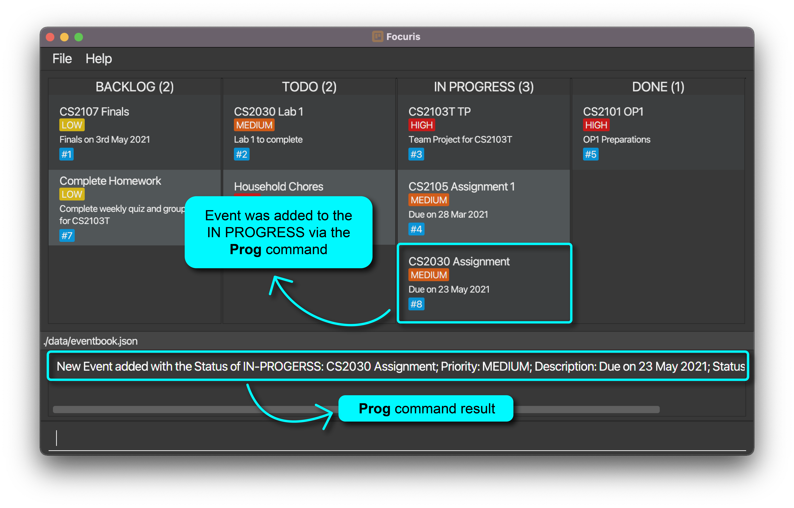

**More Sample Commands:**

| No  | Example Command                                                               | Expected Command Result                                                                                                                     |
| --- | ----------------------------------------------------------------------------- | ------------------------------------------------------------------------------------------------------------------------------------------- |
| 1   | `prog n/Complete Homework d/Complete weekly quiz and group tasks for CS2103T` | New In-Progress added: Complete Homework; Priority: LOW; Description: Complete weekly quiz and group tasks for CS2103T; Status: IN_PROGRESS |
| 2   | `prog n/Household Chores d/Cleaning the kitchen p/high`                       | New In-Progress added: Household Chores; Priority: HIGH; Description: Cleaning the kitchen; Status: IN_PROGRESS                             |
| 3   | `prog n/Lunch with John d/At VivoCity on Friday p/medium`                     | New In-Progress added: Lunch with John; Priority: MEDIUM; Description: At VivoCity on Friday; Status: IN_PROGRESS                           |
| 4   | `prog n/Run d/Exercise p/h`                                                   | New In-Progress added: Run; Priority: HIGH; Description: Exercise; Status: IN_PROGRESS                                                      |

<a class="md-btn md-btn-outline" href="#table-of-contents">Return to Table of Contents</a>

<div class="page-break-before"></div>

### 2.3.4 `edit` Command

Edits an existing event in Focuris.

**What you should type into the Command Box:**

```
edit IDENTIFIER [n/NAME] [d/DESCRIPTION] [s/STATUS] [p/PRIORITY]
```

**Things you should take note about the `edit` command:**

- The identifier refers to the index number shown in the respective displayed event list.
- The identifier **must be a positive integer** 1, 2, 3, …​.
- At least one of the optional fields must be provided.

<div markdown="block" class="alert alert-warning">
:exclamation: **Caution**

Existing event will have its data overwritten by the new values taken in by the `edit` command.

</div>

**What you should expect to happen:**

- Before executing `edit 6 n/CS2040S d/Merge Sort Algorithm p/m`:
  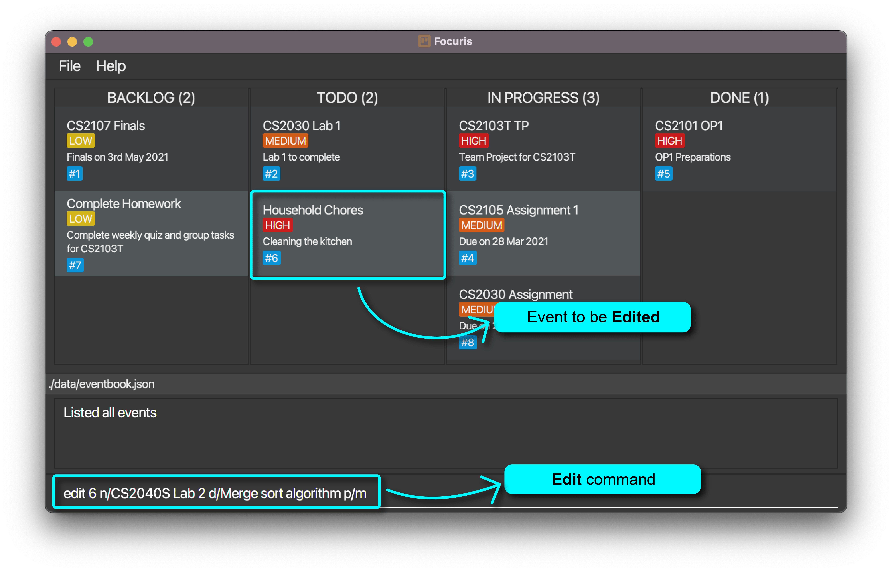

- After executing `edit 6 n/CS2040S d/Merge Sort Algorithm p/m`:
  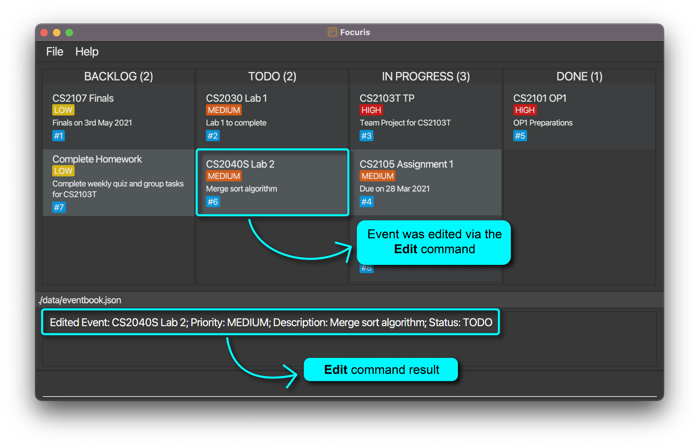

**More Sample Commands:**

- `edit 1 n/CS2030 d/Assignment` Edits the event name and event description of the event with identifier `#1` to be `CS2030` and `Assignment` respectively.
- `edit 2 s/backlog` Edits the status of the event with identifier `#2` to be `BACKLOG`.
- `edit 3 n/CS1101S d/Streams assignment s/in_progress p/high` Edits event the event name, description, status and priority of the event with identifier `#3` to be `CS1101S`, `Streams assignment`, `IN_PROGRESS`, `HIGH` respectively.
- `edit 4 s/d p/l` Edits the status and the priority of the event with identifier `#4` to be `DONE` and `LOW` respectively.

<a class="md-btn md-btn-outline" href="#table-of-contents">Return to Table of Contents</a>

<div class="page-break-before"></div>

### 2.3.5 `delete` Command

Deletes the specified event from Focuris.

**What you should type into the Command Box:**

```
delete IDENTIFIER
```

- The identifier refers to the number beside the hex symbol, e.g. `#10` has an identifier of 10.
- The identifier **must be a positive integer** 1, 2, 3, …​.

**What you should expect to happen:**

- Before execution of `delete 7` command:
  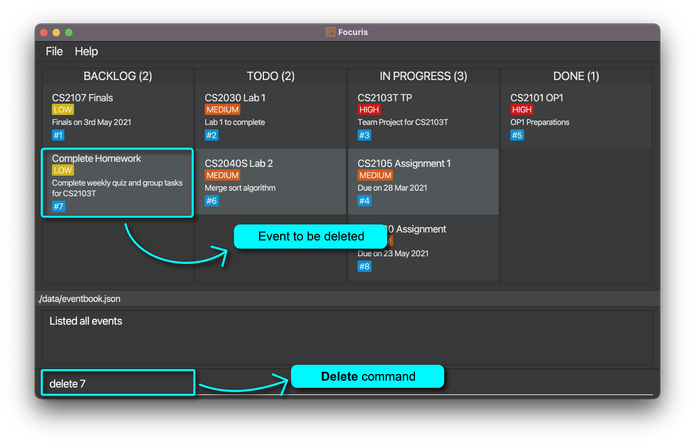
- After execution of `delete 7` command:
  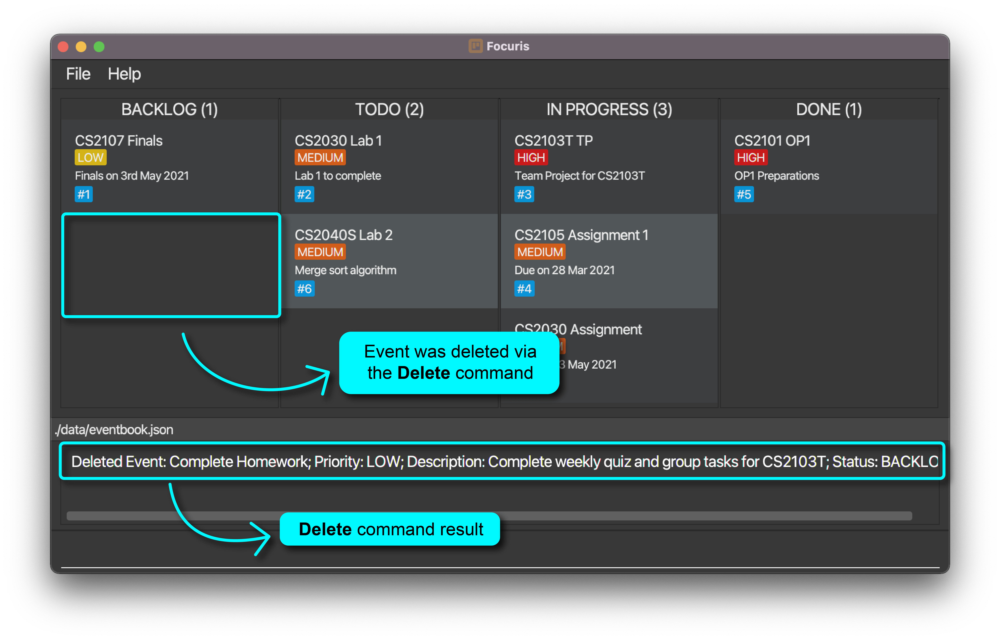

**More Sample Commands:**

| No  | Example Command | Expected Command Result                                                                  |
| --- | --------------- | ---------------------------------------------------------------------------------------- |
| 1   | `delete 1`      | Deleted Event: CS2030 Lab 1; Status: TODO; Description: Lab 1 to complete                |
| 2   | `delete 5`      | Deleted Event: CS2105 Assignment 2; Status: IN_PROGRESS; Description: Due on 28 Mar 2021 |

<div markdown="block" class="alert alert-info">

**:information_source: Note:** <br>
The commands in the table above make reference to the events in Focuris as seen in the screenshot below _After execution of `delete 7` command:_.

</div>

<a class="md-btn md-btn-outline" href="#table-of-contents">Return to Table of Contents</a>

<div class="page-break-before"></div>

### 2.3.6 `clear` Command

Clears all events in Focuris.

**What you should type into the Command Box:**

```
clear
```

<div markdown="block" class="alert alert-warning">
:exclamation: **Caution:**
All events will be cleared from Focuris and this is **irreversible**. Please use this command with care.

</div>

**What you should expect to happen:**

- Before execution of the `clear` command:
  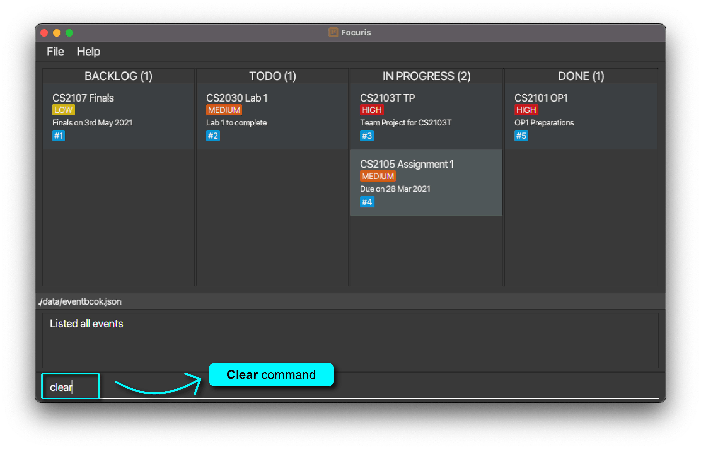
- After execution of the `clear` command:
  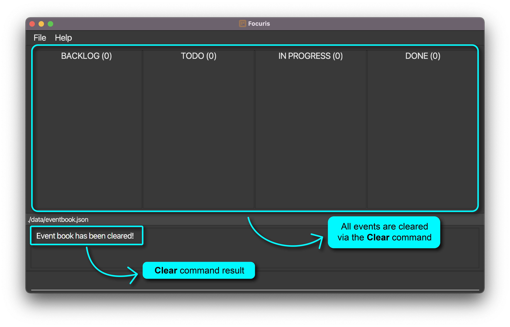

<a class="md-btn md-btn-outline" href="#table-of-contents">Return to Table of Contents</a>

<div class="page-break-before"></div>

### 2.3.7 `find` Command

Finds events whose names and description contain any of the given keywords.

**What you should type into the Command Box:**

```
find KEYWORD [MORE_KEYWORDS]...
```

**Things you should take note about the `find` command:**

- Your keyword inputs are [case-insensitive](#case-insensitive).
  - e.g. `cs2103` will match `cs2103`, `cS2103`, `Cs2103` and `CS2103`
- The order of your inputs will not matter.
  - e.g. `CS2103T Project` will match `Project CS2103T`
- Your keywords will only be matched with full words.
  - e.g. `CS2103` will not match `CS2103T`
- If your keywords match at least one word in an Event's `NAME` or `DESCRIPTION`, you should see it in the output.
  - e.g. `CS2103T` will match `CS2103T Project`, `CS2103T v1.3 Deadline`, etc.
- Focuris will try to match your keywords with any Events by their `NAME` and `DESCRIPTION` parameters only. You can get more information about parameters [here](#212-parameter-summary).

**What you should expect to happen:**

- Before execution of `find cs2040s` command:
  
- After execution of `find cs2040s` command:
  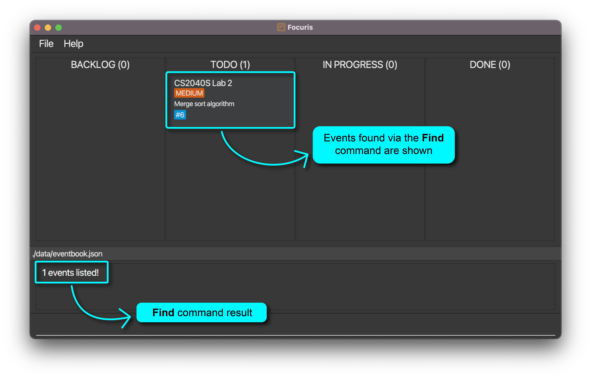

**More Example Commands:**

| No  | Example Command      | Expected events to match                                                                    |
| --- | -------------------- | ------------------------------------------------------------------------------------------- |
| 1   | `find cs2101 op1`    | Events with either `cs2101` or `op1` in their names or descriptions will be matched         |
| 2   | `find CS2103T`       | Events with either `cs2103t` in their names or descriptions will be matched                 |
| 3   | `find one two three` | Events with either `one` or `two` or `three` in their names or descriptions will be matched |

<div markdown="block" class="alert alert-info">

**:information_source: Note:**<br>

- The `Expected events to match` column in the table above displays the names in lower-case, but keywords in any case is matched, e.g. `cs2103` will match `Cs2103`, `cS2103`, `CS2103` and `cs2103`.

</div>

<a class="md-btn md-btn-outline" href="#table-of-contents">Return to Table of Contents</a>

<div class="page-break-before"></div>

### 2.3.8 `list` Command

Lists all of your events in Focuris. Typically used after using [`find`](#237-find-command).

**What you should type into the Command Box:**

```
list
```

**What you should expect to happen:**

- After execution of `find cs2040s` command:
  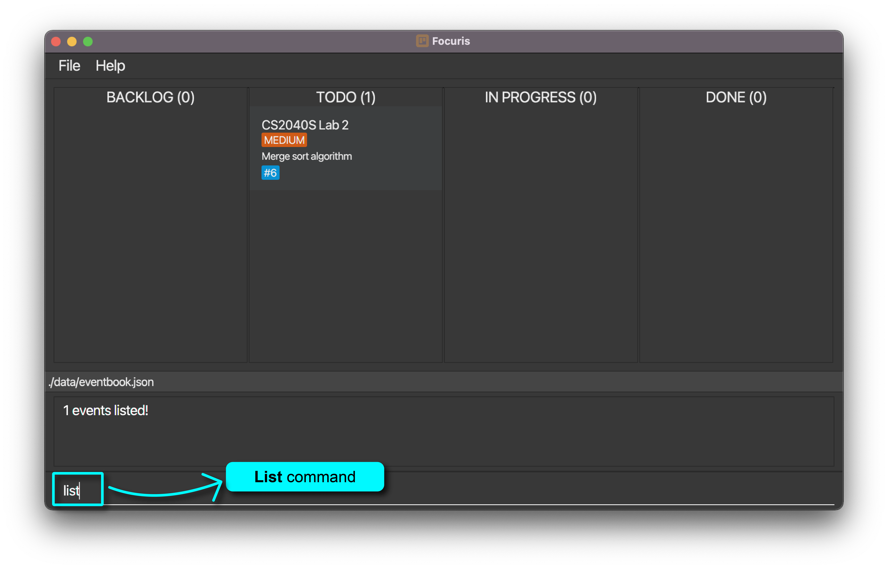
- After execution of `list` command:
  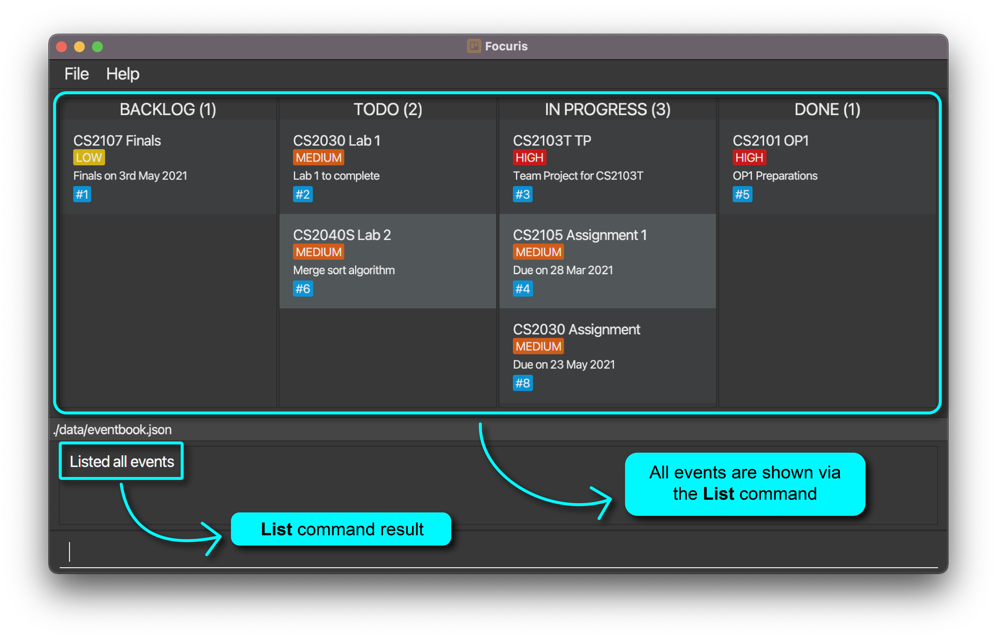

<a class="md-btn md-btn-outline" href="#table-of-contents">Return to Table of Contents</a>

<div class="page-break-before"></div>

### 2.3.9 `done` Command

Set the status of an Event to `DONE`.

**What you should type into the Command Box:**

```
done IDENTIFIER
```

**What you should expect to happen:**

- Before the execution of the `done 4` command:
  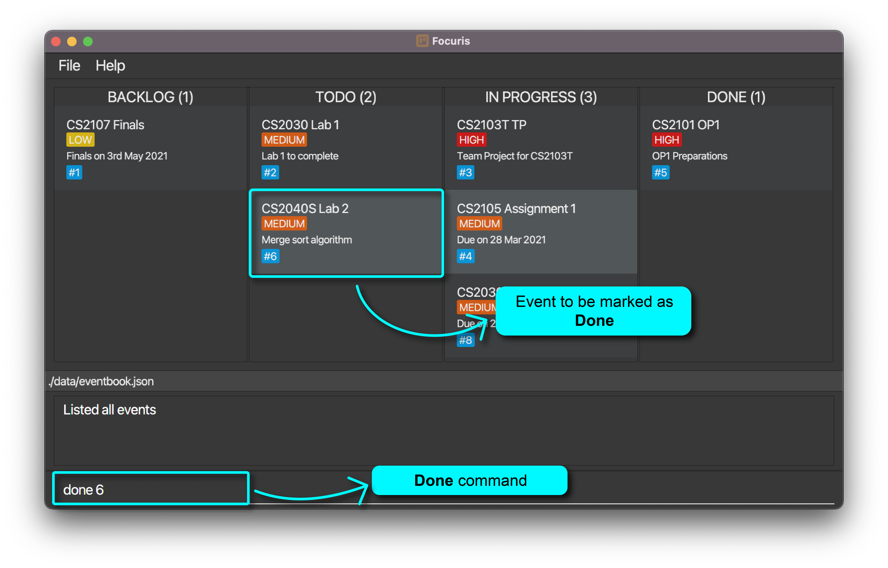

- After the execution of `done 4` command:
  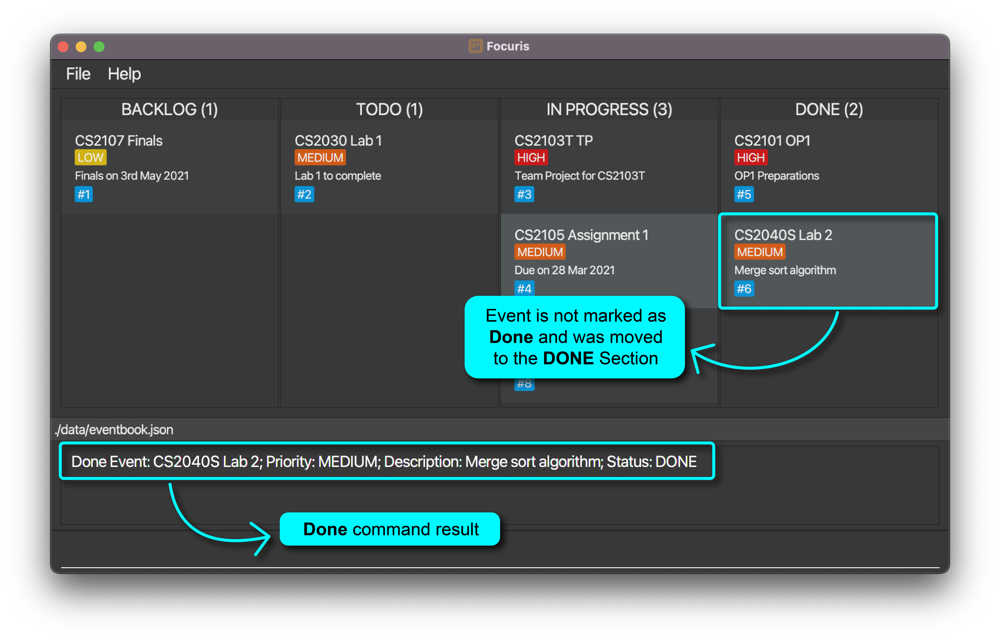

<a class="md-btn md-btn-outline" href="#table-of-contents">Return to Table of Contents</a>

<div class="page-break-before"></div>

### 2.3.10 `switch` Command

Toggle between `list` and `kanban` views

**What you should type into the Command Box:**

```
switch
```

**What you should expect to happen:**

- Before execution of the `switch` command, in `KanBan` view:
  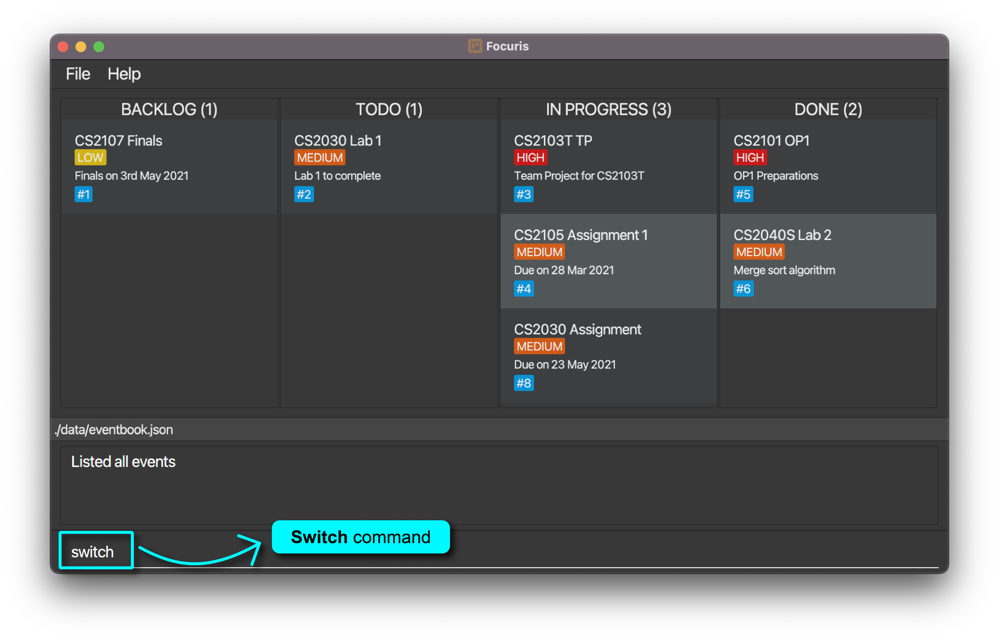

- After execution of the `switch` command, from `KanBan` view to `List` view:
  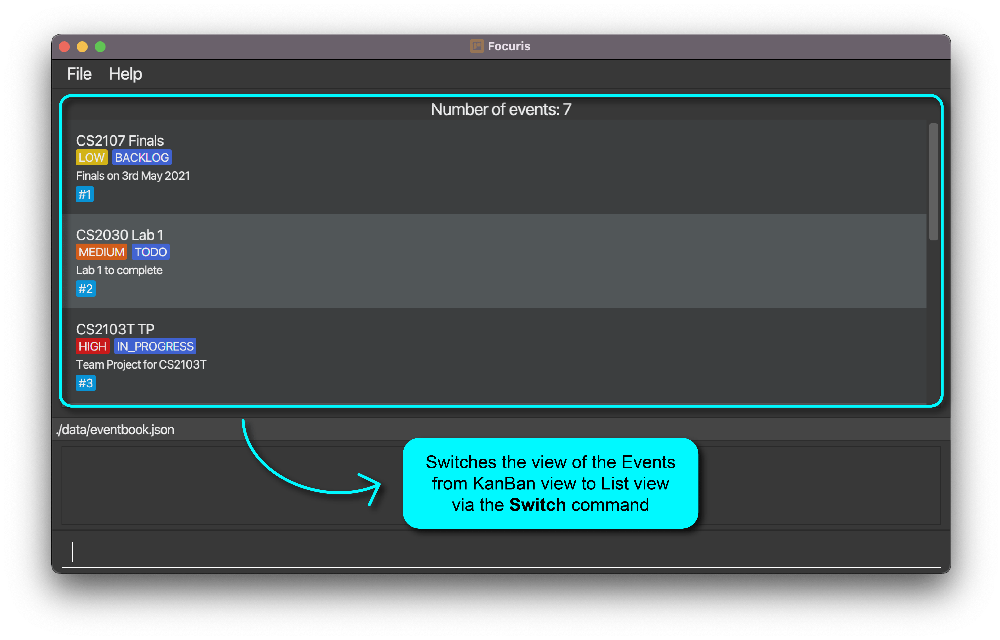

<a class="md-btn md-btn-outline" href="#table-of-contents">Return to Table of Contents</a>

<div class="page-break-before"></div>

# 3. FAQ

As a new user to Focuris, you might have many unanswered queries. We hope that the Frequently Asked Questions (FAQ) addresses your concerns and you are able to start using Focuris to manage and keep track of all your work, deadlines and projects today!

**Here are the areas covered in the FAQ:**

- [3.1 Privacy and Data FAQ](#31-privacy-and-data-faq)
- [3.2 Application User FAQ](#32-application-user-faq)

<a class="md-btn md-btn-outline" href="#table-of-contents">Return to Table of Contents</a>

<div class="page-break-before"></div>

## 3.1 Privacy and Data FAQ

As a user, you might be concerned about your privacy and data. We seek to address your privacy and data concerns in this section.

**Q**: How do I transfer my data to another Computer?<br>
**A**: Install the app in the other computer and overwrite the empty data file it creates with the file that contains the data of your previous Focuris home folder.

**Q**: Does this application require an Internet connection?<br>
**A**: No, Focuris does not require an Internet connection to use.

**Q**: What is the maximum length of text I can enter into a event name or event description?<br>
**A**: Focuris does not limit the maximum length of text that can be entered and stored as it will increase the size
of the card to fit the text given. However, the general notion we try to promote is **efficiency** and **productivity**,
and thus we recommend keeping the text under **20 characters** for the event name, and **40 characters** for the description.

**Q**: Will my data be sent anywhere else or shared with third parties?<br>
**A**: Your data is stored locally on your own computer. Focuris does not use any Internet connection so no data can be
sent to any online servers.

<a class="md-btn md-btn-outline" href="#table-of-contents">Return to Table of Contents</a>

<div class="page-break-before"></div>

## 3.2 Application User FAQ

As a new user to Focuris, you might encounter have certain queries regarding how the application logic behind Focuris works. We seek to address your queries and help you get a better understanding of how Focuris works.

**Q**: Why are multiple Events of the same name not allowed in our application?<br>
**A**: We believe that tasks should be broken down into small components such that the title should be self-descriptive of the task. Therefore, we believe that Events of the same name are not allowed since you could probably break the task down into smaller parts or add unique descriptors to the name of the task to help yourself differentiate tasks even quicker.

**Q**: Why are the identifiers of my Events not in counting order?<br>
**A**: Identifiers are meant to be unique to each task. Whenever a new Event is created, the identifier counter increases. The counter does not decrease since this could potentially lead to issues whereby the identifier is no longer unique, which would cause the functionality of Focuris to be compromised. As such, we believe that an identifier that does not reset or decrease in a single session is best suited for such a task.

**Q**: Why are identifiers not resetting when I run the `clear` command to clear all Events?<br>
**A**: Identifiers are meant to be unique to each task. Therefore, during each of your sessions on Focuris, the identifiers will not be reset. However, when you restart the application, the identifiers will be reset as each Event is being added into Focuris from the data file. This ensures that identifiers assigned to new tasks are always unique, following the practices of GitHub and Jira.

<a class="md-btn md-btn-outline" href="#table-of-contents">Return to Table of Contents</a>

<div class="page-break-before"></div>

# 4. Glossary

<a name="case-insensitive" class="do-not-decorate"><bold>Case Insensitive</bold>: Case Insensitive means that a word input in upper case and lower case will be taken the same way.</a>

<a name="parameters" class="do-not-decorate"><bold>Parameters</bold>: Parameters are the input given to commands behind prefixes such as `n/`.</a>

<a name="special-characters" class="do-not-decorate"><bold>Special Characters</bold>: Characters that are neither alphabets, from A to Z, nor digits, from 0 to 9.</a>

<a class="md-btn md-btn-outline" href="#table-of-contents">Return to Table of Contents</a>
