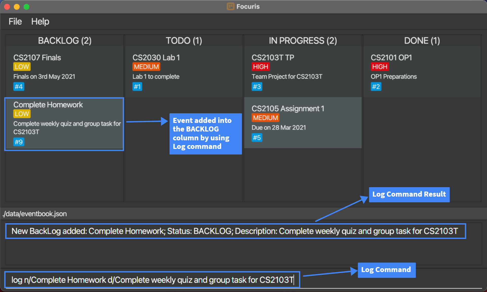
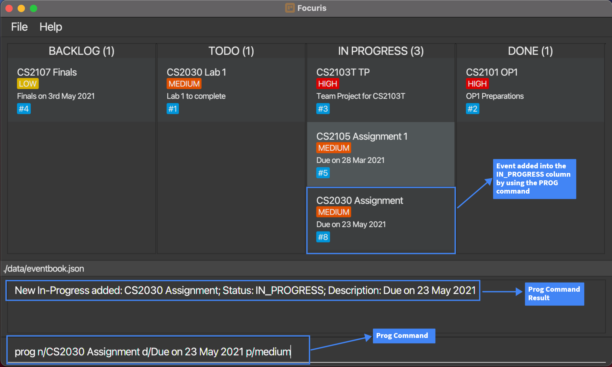
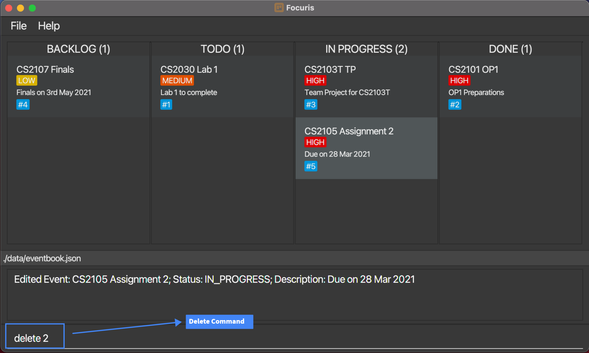
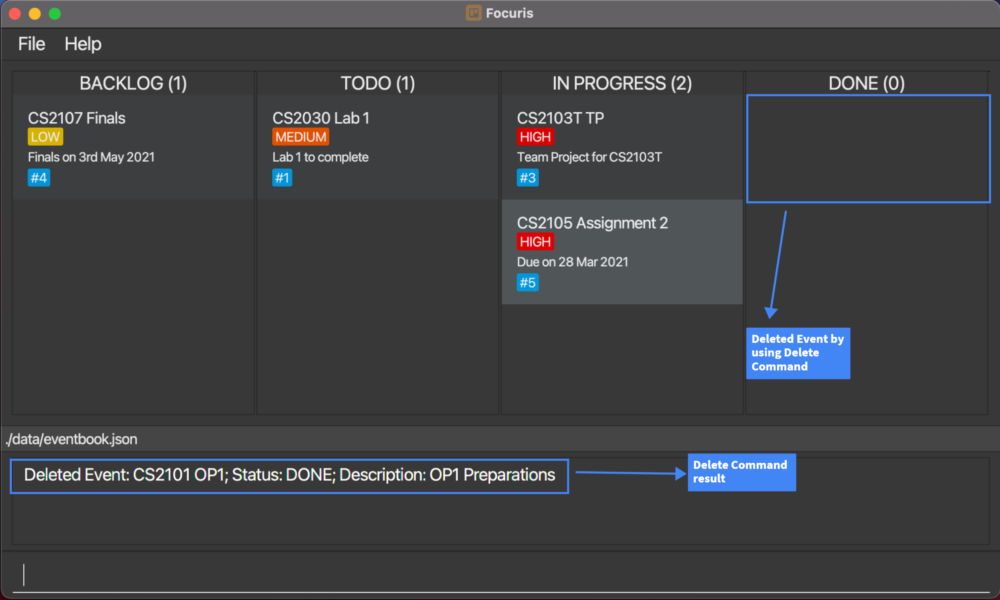
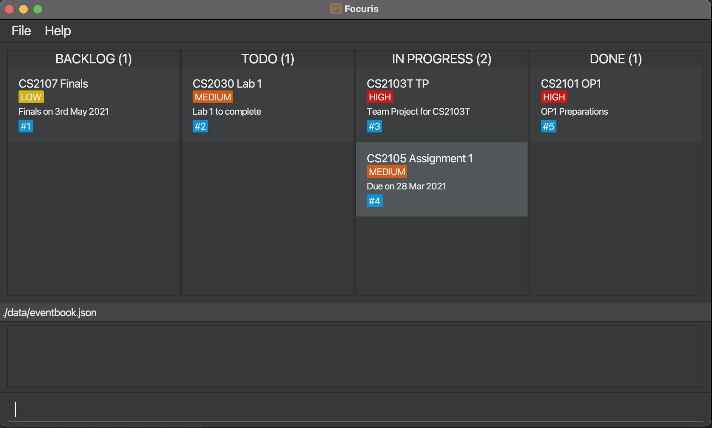
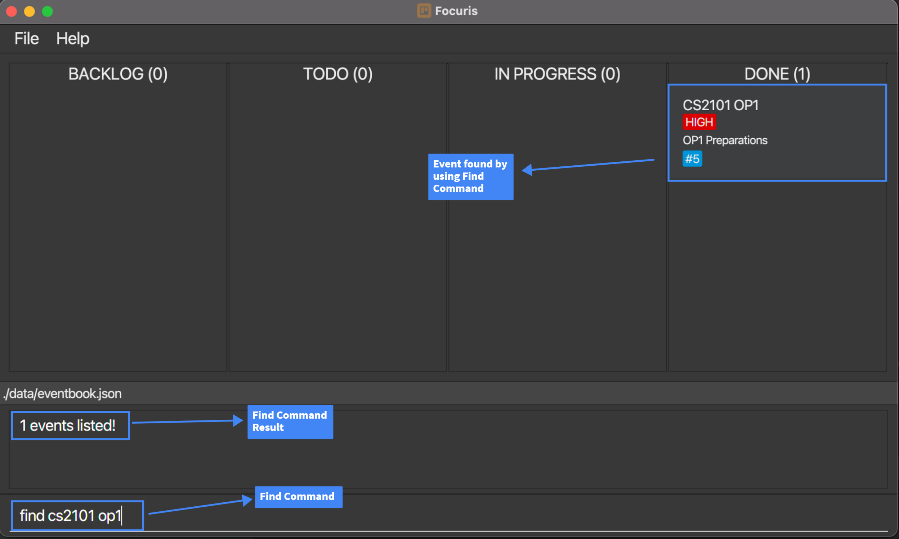

# Welcome to Focuris User Guide!

Focuris is a **desktop application** for **managing events** with a KanBan board. The KanBan board is a board which 
**displays events according to the level of completion**: Backlog, Todo, In-Progress and Done. <br/>

Focuris aims to help **university students** like you to keep track of your tasks or events in order to help improve time management 
and organisation.

## Here's why you should use Focuris:

- Helps with task management and scheduling with a simple and easy to navigate interface.
- Use of a Command Line Interface (CLI) allows fast typists to manage your event boards faster than applications with a Graphical User Interface (GUI).
- Prioritize your tasks by looking at their priority level, from **Low** to **High**.
- Get instant overview on the level of completion of each of your tasks.

---

<div class="page-break-before"></div>

# Table Of Contents

<!-- prettier-ignore-start -->
<!-- AUTO-GENERATED TOC - START -->

* Table of Contents
{:toc}

<!-- AUTO-GENERATED TOC - END -->
<!-- prettier-ignore-end -->

---

<div class="page-break-before"></div>

# 1. Quick start

This section will explain how you can get Focuris up and running in the shortest way possible.

Start improving your productivity by following these simple steps:

1. Ensure you have Java `11` or above installed on your Computer.

1. You can download the latest `focuris.jar` from [here](https://github.com/AY2021S2-CS2103T-W15-4/tp/releases/tag/v1.3).

1. Copy the `focuris.jar` file to the folder you want to use as the _home folder_ for your installation of Focuris.

1. Double-click the `focuris.jar` file to start Focuris. 
   You should be able to see the graphical user interface within a few seconds. Note that the application contains some sample data since you are new to the application. <br/>
   The image below is the interface you will see when you first start up Focuris.
   <br> 

1. Type the command in the command box and press Enter to execute it. e.g. typing **`help`** and pressing Enter will open the help window.<br>
   Here are some commands you can get started with:

   - **`todo`**`n/CS2030 Lab 1 d/Lab 1 to complete` : Adds an event named `CS2030 Lab 1` to the application with status `TODO`.

   - **`log`**`n/CS2107 Finals d/Finals on 3rd May 2021` : Adds an event named `CS2107 Finals` to the application with status `BACKLOG`.

   - **`prog`**`n/CS2100 d/Lab` : Adds an event named `CS2100` to the application with status `IN PROGRESS`.

   - **`delete`**`3` : Deletes the event with the identifier of 3 shown on the KanBan board.

   - **`exit`** : Exits the application.

1. Refer to the [Features](#2-features) below for how you can utilise each command.

<a class="md-btn md-btn-raised" href="#table-of-contents">Return to Table of Contents</a>

<div class="page-break-before"></div>

# 2. Features

You will find out more about the various commands we have in Focuris after reading this chapter.

Continue reading for more ways to improve your productivity with Focuris!

<div markdown="block" class="alert alert-info">

**:information_source: Please take note about the following when you enter commands into Focuris**<br>

- Words in `UPPER_CASE` are the [parameters](#parameters) you can provide to Focuris.<br>
  e.g. in `todo n/NAME d/DESCRIPTION`, `NAME` is a [parameter](#parameters) which can be used as `todo n/CS2030`.

- Items in square brackets are optional.<br>
  e.g `n/NAME d/DESCRIPTION [p/PRIORITY]` can be used as `n/CS2030 d/Assignement p/HIGH` or as `n/CS2030 d/Assignment`.

- You can type in the [parameters](#parameters) in any order.<br>
  e.g. if the command specifies `n/NAME d/DESCRIPTION`, you can type it as `d/DESCRIPTION n/NAME` as well.

- If a [parameter](#parameters) is expected only once in the command but you specified it multiple times, only the last occurrence of the [parameter](#parameters) will be taken.<br>
  e.g. if you specify `d/walk d/run`, only `d/run` will be taken.

- Extraneous [parameters](#parameters) for commands that do not take in [parameters](#parameters) (such as `help` and `exit`) will be ignored.<br>
  e.g. if you type `help 123`, Focuris will only read it as `help`.

</div>

<a class="md-btn md-btn-raised" href="#table-of-contents">Return to Table of Contents</a>

<div class="page-break-before"></div>

## 2.1 Summary

The summary chapter gives you an overview of what the available commands are and what the parameters you should type into the Command Box of Focuris are.

<a class="md-btn md-btn-raised" href="#table-of-contents">Return to Table of Contents</a>

<div class="page-break-before"></div>

### 2.1.1 Command Summary

If you are an experienced user who has used Focuris before, here is a summary of the commands you can navigate between easily!

For our new users, don't be too intimidated! You can use this summary to better familiarize yourself with
the different commands available. We will delve deeper into the specifics at chapters [2.2](#22-general)
and [2.3](#23-event-commands).

| Command                           | Description                                           | Format, Examples                                                                                           |
| --------------------------------- | ----------------------------------------------------- | ---------------------------------------------------------------------------------------------------------- |
| [**Clear**](#236-clear-command)   | **Clears** all of your events in Focuris              | `clear`                                                                                                    |
| [**Delete**](#235-delete-command) | **Deletes** your existing event in Focuris            | `delete IDENTIFIER`<br> e.g., `delete 3`                                                                   |
| [**Edit**](#234-edit-command)     | **Edits** your existing event's attributes in Focuris | `edit IDENTIFIER [n/NAME] [s/STATUS] [d/DESCRIPTION] [p/PRIORITY]`<br> e.g.,`edit 2 n/CS2030 d/Assignment` |
| [**Find**](#237-find-command)     | **Finds** your existing event by specific keywords    | `find KEYWORD [KEYWORD]...`<br> e.g., `find James Jake`                                                    |
| [**Exit**](#222-exit-command)     | **Exits** the application                             | `exit`                                                                                                     |
| [**Help**](#221-help-command)     | Displays **help menu** pop-up                         | `help`                                                                                                     |
| [**List**](#232-list-command)     | Clears your previous filters and lists all events     | `list`                                                                                                     |
| [**Log**](#232-log-command)       | Creates your new event with status **Backlog**        | `log n/NAME d/DESCRIPTION [p/PRIORITY]` <br> e.g., `log n/CS2030 d/Lab`                                    |
| [**Prog**](#233-prog-command)     | Creates your new event with status **In-Progress**    | `prog n/NAME d/DESCRIPTION [p/PRIORITY]` <br> e.g., `prog n/CS2100 d/Tutorial`                             |
| [**Todo**](#231-todo-command)     | Creates your new event with status **Todo**           | `todo n/NAME d/DESCRIPTION [p/PRIORITY]` <br> e.g., `todo n/CS2040 d/Assignment`                           |

<a class="md-btn md-btn-raised" href="#table-of-contents">Return to Table of Contents</a>

<div class="page-break-before"></div>

### 2.1.2 Parameter Summary

You may encounter several [parameters](#parameters) while typing in commands in Focuris which might be unknown to you. <br/>
The table below gives a detailed summary of the different [parameters](#parameters) you will encounter while using Focuris.

| Parameter   | Prefix    | Description                              | Constraints                                                                                                                                                                                                                                                                                |
| ----------- | --------- | ---------------------------------------- | ------------------------------------------------------------------------------------------------------------------------------------------------------------------------------------------------------------------------------------------------------------------------------------------ |
| NAME        | `n/`      | Name of your Event                       | Your Event names should not contain any [special characters](#special-characters) or be blank                                                                                                                                                                                              |
| DESCRIPTION | `d/`      | Description of your Event                | Your Event descriptions should not contain any [special characters](#special-characters) or be blank                                                                                                                                                                                       |
| PRIORITY    | `p/`      | Priority of your Event                   | Your Event priorities should be either `high`, `medium` or `low`. <br/> Priorities can be shorthanded to be `h` , `m` or `l` respectively. <br/>Priorities are [case insensitive](#case-insensitive), meaning `high` or `HiGH` would be understood the same way.<br/>                      |
| STATUS      | `s/`      | Status of your Event                     | Your Event statuses should be either `backlog`, `todo`, `in_progress` or `done`. <br/> Statuses can be shorthanded to be `bl` , `td`, `ip` or `d` respectively. <br/> Statuses are [case insensitive](#case-insensitive), meaning `backlog` or `BackLog` would be understood the same way. |
| IDENTIFIER  | No Prefix | Identifier of your Event in Focuris      | Your Event identifier should exist in the KanBan board.                                                                                                                                                                                                                                    |
| KEYWORD     | No Prefix | Keywords for searching Events in Focuris | No Constraints                                                                                                                                                                                                                                                                             |

<div markdown="block" class="alert alert-info">
**:information_source: Please take note of the following parameters** <br/>
- Priority is set to `low` if you do not specify a priority for your event. <br/>
- Identifiers are automatically generated for you, you do not need to specify an identifier for your Events
</div>

<a class="md-btn md-btn-raised" href="#table-of-contents">Return to Table of Contents</a>

<div class="page-break-before"></div>

## 2.2 General

As a new user, the image below should give you a better understanding of what each part of our graphical user interface means!


<a class="md-btn md-btn-raised" href="#table-of-contents">Return to Table of Contents</a>

<div class="page-break-before"></div>

### 2.2.1 `help` Command

Shows you a pop-up with a link to the Focuris user guide.

**What you should type into the Command Box:**

```bash
help
```

**What you should expect to happen:**

- Pop-up shows you the link to Focuris' user guide.


<a class="md-btn md-btn-raised" href="#table-of-contents">Return to Table of Contents</a>

<div class="page-break-before"></div>

### 2.2.2 `exit` Command

Exits out of Focuris.

**What you should type into the Command Box:**

```
exit
```

**What you should expect to happen:**

- Your Focuris application window closes.

<a class="md-btn md-btn-raised" href="#table-of-contents">Return to Table of Contents</a>

<div class="page-break-before"></div>

### 2.2.3 Saving of your data

Your Event data in Focuris is saved **automatically** whenever you execute any command that makes changes to events.

You can be assured that **your data is safe** and there is no need for you to save your data manually through executing a command.

<a class="md-btn md-btn-raised" href="#table-of-contents">Return to Table of Contents</a>

### 2.2.4 Editing your data file

Your data in Focuris is saved as a JSON file in this location: `[JAR_FILE_LOCATION]/data/eventbook.json`

- Where `JAR_FILE_LOCATION` refers to the folder in which you store your `focuris.jar` application.

<div markdown="block" class="alert alert-info">
:information_source: **Advanced Users:**
If you are an advanced user, you are welcome to update the data file by editing the data file directly.
</div>

<div markdown="span" class="alert alert-warning">:exclamation: **Caution:**
If your changes to the data file makes its format invalid, Focuris will discard all your existing data and start with an empty data file on the next run.
</div>

<a class="md-btn md-btn-raised" href="#table-of-contents">Return to Table of Contents</a>

<div class="page-break-before"></div>

## 2.3 Event Commands

For the majority of event commands, you can simply execute them via these simple steps:

1. Type the command you desire in the command box with the specified format detailed below.
2. Hit `enter` on your keyboard!
3. The results and outcome of your command should be visible on the application just above the Command Box.

Start discovering and using the Commands now by going to the Command Summary!

<a class="md-btn-outline" href="#211-command-summary">Bring me to the Command Summary</a>

<a class="md-btn md-btn-raised" href="#table-of-contents">Return to Table of Contents</a>

<div class="page-break-before"></div>

### 2.3.1 `todo` Command

Adds an event with status `TODO` to Focuris.

**What you should type into the Command Box:**

```
todo n/NAME d/DESCRIPTION [p/PRIORITY]
```

**What you should expect to happen:**

- After typing
  `todo n/Household Chores d/Cleaning the kitchen p/high`
  and pressing enter:


_Figure 1. Shows the result **after** execution of Example Command 1 in the table below._

**More Sample Commands:**

| No  | Example Command                                                               | Expected Command Result                                                                                                        |
| --- | ----------------------------------------------------------------------------- | ------------------------------------------------------------------------------------------------------------------------------ |
| 1   | `todo n/Household Chores d/Cleaning the kitchen p/high`                       | New Todo added: Household Chores; Priority: HIGH; Description: Cleaning the kitchen; Status: TODO;                             |
| 2   | `todo n/CS2030 Assignment 1 d/Due on 23 Mar 2021 p/high`                      | New Todo added: CS2030 Assignment 1; Priority: HIGH; Description: Due on 23 Mar 2021; Status: TODO;                            |
| 3   | `todo n/Lunch with John d/At VivoCity on Friday p/medium`                     | New Todo added: Lunch with John; Priority: MEDIUM; Description: At VivoCity on Friday; Status: TODO;                           |
| 4   | `todo n/Complete Homework d/Complete weekly quiz and group tasks for CS2103T` | New Todo added: Complete Homework; Priority: LOW; Description: Complete weekly quiz and group tasks for CS2103T; Status: TODO; |
| 5   | `todo n/Run d/Exercise p/h`                                                   | New Todo added: Run; Priority: HIGH; Description: Exercise; Status: TODO;                                                      |

<a class="md-btn md-btn-raised" href="#table-of-contents">Return to Table of Contents</a>

<div class="page-break-before"></div>

### 2.3.2 `log` Command

Adds an event with status `BACKLOG` to Focuris.

**What you should type into the Command Box:**

```
log n/NAME d/DESCRIPTION [p/PRIORITY]
```

**What you should expect to happen:**

- After typing `log n/Complete Homework d/Complete weekly quiz and group tasks for CS2103T` and pressing enter:



_Figure 2. Shows the result after execution of Example Command 1 in the table below._

**More Sample Commands:**

| No  | Example Command                                                              | Expected Command Result                                                                                                              |
| --- | ---------------------------------------------------------------------------- | ------------------------------------------------------------------------------------------------------------------------------------ |
| 1   | `log n/Complete Homework d/Complete weekly quiz and group tasks for CS2103T` | New BackLog added: Complete Homework; Priority: LOW; Description: Complete weekly quiz and group tasks for CS2103T; Status: BACKLOG; |
| 2   | `log n/Household Chores d/Cleaning the kitchen p/high`                       | New BackLog added: Household Chores; Priority: HIGH; Description: Cleaning the kitchen; Status: BACKLOG;                             |
| 3   | `log n/CS2030 Assignment 1 d/Due on 23 Mar 2021 p/high`                      | New BackLog added: CS2030 Assignment 1; Priority: HIGH; Description: Due on 23 Mar 2021; Status: BACKLOG;                            |
| 4   | `log n/Lunch with John d/At VivoCity on Friday p/medium`                     | New BackLog added: Lunch with John; Priority: MEDIUM; Description: At VivoCity on Friday; Status: BACKLOG;                           |
| 5   | `log n/Run d/Exercise p/h`                                                   | New BackLog added: Run; Priority: HIGH; Description: Exercise; Status: BACKLOG;                                                      |

<a class="md-btn md-btn-raised" href="#table-of-contents">Return to Table of Contents</a>

<div class="page-break-before"></div>

### 2.3.3 `prog` Command

Adds an event with status `IN PROGRESS` to Focuris.

**What you should type into the Command Box:**

```
prog n/NAME d/DESCRIPTION [p/PRIORITY]
```

**What you should expect to happen:**

- After typing `prog n/CS2030 Assignment d/Due on 23 May 2021 p/medium` and pressing enter:



_Figure 3. Shows the result **after** execution of Example Command 1 below._

**More Sample Commands:**

| No  | Example Command                                                               | Expected Command Result                                                                                                                      |
| --- | ----------------------------------------------------------------------------- | -------------------------------------------------------------------------------------------------------------------------------------------- |
| 1   | `prog n/CS2030 Assignment d/Due on 23 May 2021 p/medium`                      | New In-Progress added: CS2030 Assignment 1; Priority: MEDIUM; Description: Due on 23 Mar 2021; ; Status: IN_PROGRESS;                        |
| 2   | `prog n/Complete Homework d/Complete weekly quiz and group tasks for CS2103T` | New In-Progress added: Complete Homework; Priority: LOW; Description: Complete weekly quiz and group tasks for CS2103T; Status: IN_PROGRESS; |
| 3   | `prog n/Household Chores d/Cleaning the kitchen p/high`                       | New In-Progress added: Household Chores; Priority: HIGH; Description: Cleaning the kitchen; Status: IN_PROGRESS;                             |
| 4   | `prog n/Lunch with John d/At VivoCity on Friday p/medium`                     | New In-Progress added: Lunch with John; Priority: MEDIUM; Description: At VivoCity on Friday; Status: IN_PROGRESS;                           |
| 5   | `prog n/Run d/Exercise p/h`                                                   | New In-Progress added: Run; Priority: HIGH; Description: Exercise; Status: IN_PROGRESS;                                                      |

<a class="md-btn md-btn-raised" href="#table-of-contents">Return to Table of Contents</a>

<div class="page-break-before"></div>

### 2.3.4 `edit` Command

Edits an existing event in Focuris.

**What you should type into the Command Box:**

```
edit IDENTIFIER [n/NAME] [d/DESCRIPTION] [s/STATUS] [p/PRIORITY]
```

**Things you should take note about the `edit` command:**

- The identifier refers to the index number shown in the respective displayed event list.
- The identifier **must be a positive integer** 1, 2, 3, …​
- At least one of the optional fields must be provided.

<div markdown="block" class="alert alert-info">
:exclamation: **Caution**

Existing event will have its data overwritten by the new values taken in by the `edit` command

</div>

**What you should expect to happen:**

- Before you execute the command:


_Figure 4. Shows Focuris **before** execution of the edit command in the command box._

- After typing in `edit 5 n/CS2105 Assignment 2 p/high` and pressing enter:


_Figure 5. Shows Focuris **after** execution of the edit command in the command box._

**More Sample Commands:**

- `edit 1 n/CS2030 d/Assignment` Edits the event name and event description of the event with identifier `#1` to be `CS2030` and `Assignment` respectively.
- `edit 2 s/backlog` Edits the status of the event with identifier `#2` to be `BACKLOG`
- `edit 3 n/CS1101S d/Streams assignment s/in_progress p/high` Edits event the event name, description, status and priority of the event with identifier `#3` to be `CS1101S`, `Streams assignment`, `IN_PROGRESS`, `HIGH` respectively.
- `edit 4 s/d p/l` Edits the status and the priority of the event with identifier `#4` to be `DONE` and `LOW` respectively.

<a class="md-btn md-btn-raised" href="#table-of-contents">Return to Table of Contents</a>

<div class="page-break-before"></div>

### 2.3.5 `delete` Command

Deletes the specified event from Focuris.

**What you should type into the Command Box:**

```
delete IDENTIFIER
```

- The identifier refers to the number beside the hex symbol, e.g. `#10` has an identifier of 10.
- The identifier **must be a positive integer** 1, 2, 3, …​

**What you should expect to happen:**

- Before executing the command:



_Figure 6. Shows Focuris **before** the execution of the delete command in the command box._

- After typing `delete 2` and pressing enter:



_Figure 7. Shows Focuris **after** the execution of the delete command in the command box._

**More Sample Commands:**

| No  | Example Command | Expected Command Result                                                                  |
| --- | --------------- | ---------------------------------------------------------------------------------------- |
| 1   | `delete 1`      | Deleted Event: CS2030 Lab 1; Status: TODO; Description: Lab 1 to complete;               |
| 2   | `delete 5`      | Deleted Event: CS2105 Assignment 2; Status: IN_PROGRESS; Description: Due on 28 Mar 2021 |

<div markdown="block" class="alert alert-info">

**:information_source: Note** <br>
The commands in the table above make reference to the events in Focuris as seen in Figure 7.

</div>

<a class="md-btn md-btn-raised" href="#table-of-contents">Return to Table of Contents</a>

<div class="page-break-before"></div>

### 2.3.6 `clear` Command

Clears all events in Focuris.

**What you should type into the Command Box:**

```
clear
```

<div markdown="block" class="alert alert-info">
:exclamation: **Caution:**
All events will be cleared from Focuris and this is **irreversible**. Please use this command with care.

</div>

**What you should expect to happen:**

- After typing the command and executing the `clear` command, all events in Focuris are cleared.


_Figure 8. Shows Focuris after a clear command has been executed._

<a class="md-btn md-btn-raised" href="#table-of-contents">Return to Table of Contents</a>

<div class="page-break-before"></div>

### 2.3.7 `find` Command

Finds events whose names contain any of the given keywords.

**What you should type into the Command Box:**

```
find KEYWORD [MORE_KEYWORDS]...
```

**Things you should take note about the `find` command:**

- The order of the keywords does not matter. e.g. `Household Chores` will match `Chores Household`
- Only the name and description is searched.
- Only full words will be matched e.g. `Chor` will not match `Chore`
- Events matching at least one keyword will be returned (i.e. OR search). e.g. `Household` will return `Household Tidy`, `Household Clean`

**What you should expect to happen:**

- Before executing the `find` command:



_Figure 9. **Before** execution of find command_

- After typing `find cs2101 op1` and executing the command:



_Figure 10. **After** execution of sample find command_

**More Example Commands:**

- `find CS2103` returns `CS2103` and `CS2103T`
- `find assignment` returns `CS2101 assignment`, `CS2103 assignment`

<a class="md-btn md-btn-raised" href="#table-of-contents">Return to Table of Contents</a>

<div class="page-break-before"></div>

### 2.3.8 `list` Command

Lists all of your events in Focuris. Typically used after using [`find`](#237-find-command).

**What you should type into the Command Box:**

```
list
```

**What you should expect to happen:**

- After execution of the `list` command:


_Figure 11. Execution of list command after find command in Figure 10_

<a class="md-btn md-btn-raised" href="#table-of-contents">Return to Table of Contents</a>

<div class="page-break-before"></div>

## 3. FAQ

**Q**: How do I transfer my data to another Computer?<br>
**A**: Install the app in the other computer and overwrite the empty data file it creates with the file that contains the data of your previous Focuris home folder.

**Q**: Does this application require an Internet connection?<br>
**A**: No, Focuris does not require an Internet connection to use.

**Q**: What is the maximum length of text I can enter into a event name or event description?<br>
**A**: Focuris does not limit the maximum length of text that can be entered and stored as it will increase the size
of the card to fit the text given. However, the general notion we try to promote is **efficiency** and **productivity**,
and thus we recommend keeping the text under **20 characters** for the event name, and **40 characters** for the description.

**Q**: Will my data be sent anywhere else or shared with third parties?<br>
**A**: Your data is stored locally on your own computer. Focuris does not use any Internet connection so no data can be
sent to any online servers.

<a class="md-btn md-btn-raised" href="#table-of-contents">Return to Table of Contents</a>

<div class="page-break-before"></div>

## 4. Glossary

<a name="case-insensitive"><bold>Case Insensitive</bold>: Case Insensitive means that a word input in upper case and lower case will be taken the same way.</a>

<a name="parameters"><bold>Parameters</bold>: Parameters are the input given to commands behind prefixes such as `n/`.</a>

<a name="special-characters"><bold>Special Characters</bold>: Characters that are neither alphabets, from A to Z, nor digits, from 0 to 9.</a>

<a class="md-btn md-btn-raised" href="#table-of-contents">Return to Table of Contents</a>
